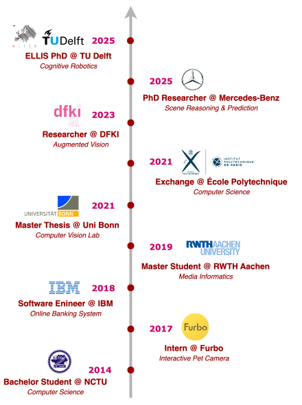

My name is Chun-Peng Chang from Taiwan. I hold a Master’s degree in Media Informatics from RWTH Aachen and completed my Master’s thesis at the Computer Vision Lab of the University of Bonn under the supervision of [Prof. Jürgen Gall](https://pages.iai.uni-bonn.de/gall_juergen/). I am currently a ELLIS PhD candidate at TU Delft (Cognitive Robotics) with [Dr. Holger Caesar](https://sites.google.com/it-caesar.de/homepage/), focusing on foundation models in machine perception. Previously, I worked as a researcher at DFKI in Kaiserslautern, Germany, with [Dr. Alain Pagani](https://av.dfki.de/members/pagani/), where I developed algorithms for real-time scene understanding and visual-textual reasoning to improve human-robot collaboration in industrial environments.

In addition to my academic work, I have gained practical experience through internships and research collaborations with companies such as Tomofun, IBM, and Mercedes-Benz.

